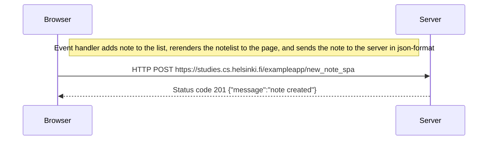

```mermaid
  sequenceDiagram
    participant Browser
    participant Server
    Note right of Browser: Event handler adds note to the list, rerenders the notelist to the page, and sends the note to the server in json-format
    Browser->>Server: HTTP POST https://studies.cs.helsinki.fi/exampleapp/new_note_spa
    Server-->>Browser: Status code 201 {"message":"note created"}
```
